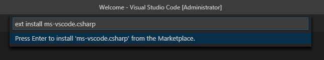

k8s-101 Installation Guide
==========================
_To participate in the workshop, you'll need the following tools and accounts._

General tools
-------------

### Git and GitHub
You'll need git installed and a GitHub account to complete the workshop.

1. Create a new GitHub account [here](https://github.com/join)
2. Download and install git following [these instructions](https://git-scm.com/downloads)
3. When git is installed, you should be able to [set your username](https://help.github.com/articles/setting-your-username-in-git/) and [commit email address](https://help.github.com/articles/setting-your-commit-email-address-in-git/). Use the same email that you registered at GitHub.


Azure and C#
------------
_All code examples will be given in .NET Core, and we'll create our Kubernetes cluster on Azure._

### .NET Core 2.2 SDK (or any version newer than 2.1) and VS Code
_If you already have .NET Core installed, you can check the version with `dotnet --version`. It should be at least version 2.1_

1. Install the [.NET Core 2.2 SDK](https://www.microsoft.com/net/download) (or any version newer than 2.1)
2. If you don't already have a preferred editor for C# code, grab a copy of [VS Code](https://code.visualstudio.com/). You'll also want to get the [C# extension](https://marketplace.visualstudio.com/items?itemName=ms-vscode.csharp). Install it by pressing Ctrl+P, pasting `ext install ms-vscode.csharp` into the window and pressing enter.



### Azure free trial
If you don't have an active Azure account with available credits, the easiest option is to grab an [Azure free trial](https://azure.microsoft.com/nb-no/free) account. Just go through the registration process, verify your account, and at the end you should be able to visit the [Azure portal](https://portal.azure.com). You unfortunately have to register both a phone number and a debit or credit card, but Microsoft won't charge you if you don't upgrade the account.

_If you already have used the Azure free trial, then you'll have to register a new account with a new email. You can use the same phone number during the registration process._


Docker and Kubectl
------------------
_We'll use Docker as our container technology, and kubectl to manage out Kubernetes cluster._

### Docker

1. You'll need Docker in order to containerize applications. Depending on your plattform, the installation can be quite different.
2. It you're running Windows or Mac, we recommend installing [Docker Desktop for Windows](https://docs.docker.com/docker-for-windows/install/) or [Docker Desktop for Mac](https://docs.docker.com/docker-for-mac/install/). If you're running Linux, we recommend getting [Docker CE](https://docs.docker.com/install/linux/docker-ce/ubuntu/#install-docker-ce-1). _If you're using an older version of Windows, you'll need to install [Docker Toolbox](https://docs.docker.com/toolbox/toolbox_install_windows/)._
3. After installing Docker, it's important that you verify your installation by running `docker run hello-world` in your terminal of choice:

```shell
$> docker run hello-world

Hello from Docker!
This message shows that your installation appears to be working correctly.

To generate this message, Docker took the following steps:
 1. The Docker client contacted the Docker daemon.
 2. The Docker daemon pulled the "hello-world" image from the Docker Hub.
    (amd64)
 3. The Docker daemon created a new container from that image which runs the
    executable that produces the output you are currently reading.
 4. The Docker daemon streamed that output to the Docker client, which sent it
    to your terminal.

To try something more ambitious, you can run an Ubuntu container with:
 $ docker run -it ubuntu bash

Share images, automate workflows, and more with a free Docker ID:
 https://hub.docker.com/

For more examples and ideas, visit:
 https://docs.docker.com/engine/userguide/
```

_Note: Depending on how you installed Docker on Linux, you might have to run docker commands with sudo._

### Kubectl

1. Download and install kubectl by following [the guide for your platform](https://kubernetes.io/docs/tasks/tools/install-kubectl/). _Note: It you're already using Google Clud SDK, you can use `gcloud`-command to [install kubectl](https://kubernetes.io/docs/tasks/tools/install-kubectl/#download-as-part-of-the-google-cloud-sdk)._
2. Verify your installation by running `kubectl version` in your favorite terminal:

```shell
$> kubectl version
Client Version: version.Info{Major:"1", Minor:"9", GitVersion:"v1.9.7", GitCommit:"dd5e1a2978fd0b97d9b78e1564398aeea7e7fe92", GitTreeState:"clean", BuildDate:"2018-04-19T00:05:56Z", GoVersion:"go1.9.3", Compiler:"gc", Platform:"linux/amd64"}
Server Version: version.Info{Major:"1", Minor:"11", GitVersion:"v1.11.9", GitCommit:"16236ce91790d4c75b79f6ce96841db1c843e7d2", GitTreeState:"clean", BuildDate:"2019-03-25T06:30:48Z", GoVersion:"go1.10.8", Compiler:"gc", Platform:"linux/amd64"}
```

_Note: We won't be using [Minikube](https://kubernetes.io/docs/setup/minikube/), and will instead relying on Azure to set up a new cluster. In other words, just install kubectl, not Minikube._

