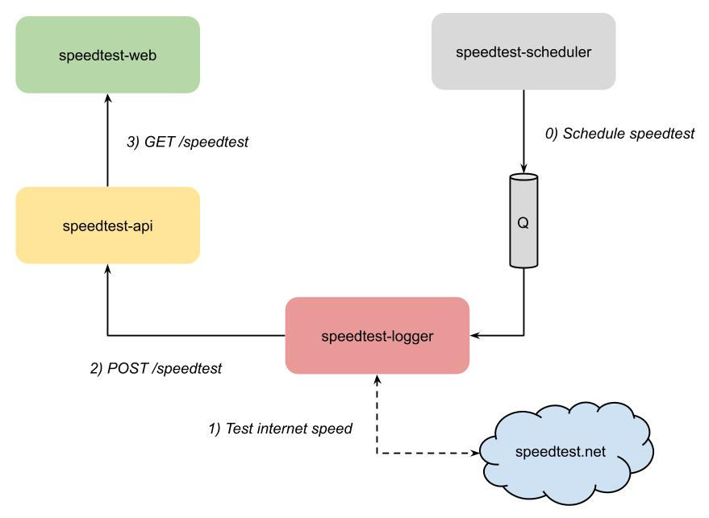

[Index](index) > All engineering worth doing, is worth over-doing
=================================================================
_In this section, we'll introduce the distributed system we'll be working with. This system might be familiar for those who participated in the [cloud-101 workshop](https://cx-cloud-101.github.io/speedtest-workshop/). Let's have a look at our system!_

So how does it work?
--------------------
TODO: General description of the system. Maybe an illustration showing how things connect. What is the system trying to "solve"?

Lets get it down!
-----------------
TODO: Instructions for downloading all the code, building and running it locally. Then we'll try it out, open the webpage, swagger UI and more.

What now?
---------
Now that we have familiarized ourselves with the speedtest system, lets continue by dockerizing the system in the [next sections](2-docker-and-conatiners).