# [Index](index) > Kubernetes and container orchestration

_Time to deploy our docker containers! in this section we'll create a Kubernetes cluster on Azure, and deploy the speedtest system on it._

## A bit about Kubernetes

Kubernetes is a container orchestration system, originally built by Google. Kubernetes can help us with several things:

- Kubernetes provides several higher level abstractions that allow us to compose containers into more advanced applications and network them together.
- When a container crashes, Kubernetes can restart the failing container.
- It maps physical or virtual computing resources together in a cluster, so we can scale the underlying infrastructure without changing the infrastructure hosting our application.
- If demand rices or sinks, Kubernetes can scale our application up or down.
- It has built-in systems for handling configuration and management of secrets like passwords and so on.

In short, Kubernetes is a bit like a cloud-platform for container-based applications, and like a cloud platform we'll just be able to scratch the surface of Kubernetes in this workshop. We'll manly focus on Kubernetes features for hosting and deploying container-based systems.

## Creating the cluster

Before we can play with Kubernetes, we'll need a Kubernetes cluster. Let's create one on Azure.

Start by navigating to the _k8s-101_ resource group, and create a Kubernetes Service.

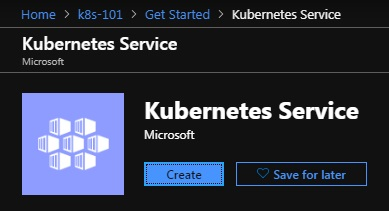

You have an awful lot of options when creating the cluster, but for our purposes, the important parts are:

Under _Basic_:

- Resource group should be _k8s-101_.
- The Kubernetes cluster name should be short and unique, for example {your initials}cluster. We'll be using `taecluster` for the duration of this workshop, but you should use your
- Region should be _(Europe) West Europe_.

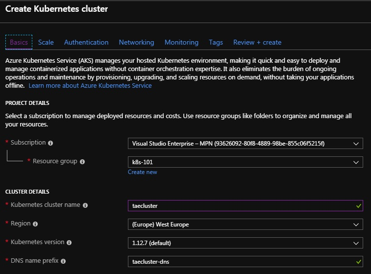

Under _Authentication_:

- _Important_ Turn off _Enable RBAC_

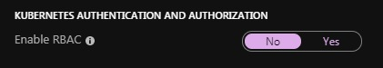

Leave everything as-is under _Scaling_, _Networking_, _Monitoring_ and _Tags_, and then create your cluster under _Review + create_.

Creating the cluster will take quite a bit of time (8 minutes when testing). Let's get started preparing speedtest-api for deployment on Kubernetes while we wait.

## Preparing speedtest-api for deployment to Kubernetes

This time we'll start with speedtest-api for a change.

Kubernetes is usually managed by writing and applying yaml-files, containing configuration of the different services, deployments, jobs, and so on, that you want to set up on Kubernetes. The configuration is written in a declarative style, where you specify what kind of system you want to set up, and not how to set up the system. Then Kubernetes will figure out how to set up the system so it matches your configuration.

Since yaml-file editing is famously error-prone, due to the indentation-sensitive nature of yaml, combined with Kubernetes love for nested configuration sections, we've supplied you with all the yaml-files you'll need to complete this workshop. They're all located in the `/Deployment`-folders in the different repositories.

### Deployments

Let's start by having a look at the first section of kind _Deployment_ in `speedtest-api.yaml`.

```yaml
apiVersion: apps/v1
kind: Deployment
metadata:
  name: speedtest-api
spec:
  replicas: 1
  selector:
    matchLabels:
      app: speedtest-api
  template:
    metadata:
      labels:
        app: speedtest-api
    spec:
      imagePullSecrets:
        - name: regcred
      containers:
        - name: speedtest-api
          image: taeregistry.azurecr.io/speed-test-api:0.0.1
          imagePullPolicy: Always
          ports:
            - containerPort: 80
          env:
            - name: hostBasePath
              value: /
```

A _Deployment_ is an object in Kubernetes that tries to keep a running container deployed. It the container isn't running, the _Deployment_ will try to start it. It the container crashes, the _Deployment_ will try to restart it, and so on.

_Deployments_ have a name, and specify how many instances of the running container it should start, but more importantly, the _Deployment_ contains information about what image should be used to create the running containers, and what environment variables should be used when running the container.

In our case, the image is specified as `taeregistry.azurecr.io/speed-test-api:0.0.1` (remember to update the registry name to your registry).

### Pods

To make matters a bit confusing, a running container in Kubernetes is called a _Pod_. (Strictly not the same, it's more like every containers are wrapped in a pod, but it's quite close for most purposes). Going forward we'll use _Pod_ to denote a running container in Kubernetes.

### Services

Now let's look at the _Service_ section:

```yaml
kind: Service
apiVersion: v1
metadata:
  name: speedtest-api-service
spec:
  type: LoadBalancer
  selector:
    app: speedtest-api
  ports:
    - protocol: TCP
      port: 80
```

The _Service_ is the Kubernetes object that we'll be able to use when we want to use speedtest-api. There're many kinds of services, but this one is set up as a _Load Balancer_, sending traffic to all pods deployed as _speedtest-api_.

## Logging in to your cluster

Is the cluster ready now? It so, then it's time to log on to our brand new Kubernetes cluster.

### Installing Azure CLI and getting cluster credentials

In order to get the credentials to connect to the cluster, we'll need to install [Azure CLI](https://docs.microsoft.com/en-us/cli/azure/install-azure-cli?view=azure-cli-latest).

Restart your terminal, and then you should be able to use the `az` command.

```shell
$> az

     /\
    /  \    _____   _ _  ___ _
   / /\ \  |_  / | | | \'__/ _\
  / ____ \  / /| |_| | | |  __/
 /_/    \_\/___|\__,_|_|  \___|


Welcome to the cool new Azure CLI!
```

Then we'll need to login to Azure using `az login`. This command will open a browser window, where we can log in using our Azure-account.

Finally we can get the cluster credentials by using `az aks get-credentials` with the resource group and cluster name.

```shell
$> az aks get-credentials --resource-group k8s-101 --name taecluster
Merged "taecluster" as current context in C:/Users/.../.kube/config
```

_If you're having problems at this point, it migth be that `az` is configured to use another subscription than the one used by k8s-101. Try [changing your active subscription](https://docs.microsoft.com/en-us/cli/azure/manage-azure-subscriptions-azure-cli?view=azure-cli-latest)._

Now `kubectl` should be authorized to access the cluster:

```shell
$> kubectl get nodes
NAME                       STATUS    ROLES     AGE       VERSION
aks-agentpool-19818267-0   Ready     agent     32m       v1.12.7
aks-agentpool-19818267-1   Ready     agent     32m       v1.12.7
aks-agentpool-19818267-2   Ready     agent     32m       v1.12.7
```

### What is kubectl?

`kubectl` is the command line tool used to manage a Kubernetes cluster. It does most things, from applying new configuration to retrieving information about the cluster.

### Authorizing your cluster for access to the private container registry

Remember the mysterious "imagePullSecrets: - name: regcred" section from `speedtest-api.yaml`? This is where we create `regcred`.

Since we're using a private container registry, we'll need to create a _secret_ in our cluster with authentication information for accessing the registry. You can du this with the following command:

```shell
&> kubectl create secret docker-registry regcred --docker-server=taeregistry.azurecr.io --docker-username=taeregistry --docker-password={your password here} --docker-email=tae@computas.com
```

**Note:** Remember to use your registry _login address_, _username_ and _password_ when running the command above.

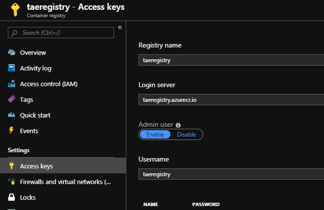

[Secrets](https://kubernetes.io/docs/concepts/configuration/secret/) is a solution for storing secret configuration information securely in Kubernetes. It can be used for any kind of secret, not just registry authentication information, and can be a good way to handle secrets in your own applications as well.

### Kubernetes Dashboard UI

To get an overview of your cluster, you can open the Kubernetes dashboard. The Dashboard UI is not deployed by default. To deploy it, run the following command:

``kubectl apply -f https://raw.githubusercontent.com/kubernetes/dashboard/v2.0.0-beta8/aio/deploy/recommended.yam`

You can access Dashboard using the kubectl command-line tool by running the following command:

```shell
$> kubectl proxy
Starting to serve on 127.0.0.1:8001
```

Now you should be able to visit the [Kubernetes dashboard](http://localhost:8001/api/v1/namespaces/kubernetes-dashboard/services/https:kubernetes-dashboard:/proxy/) in your browser.

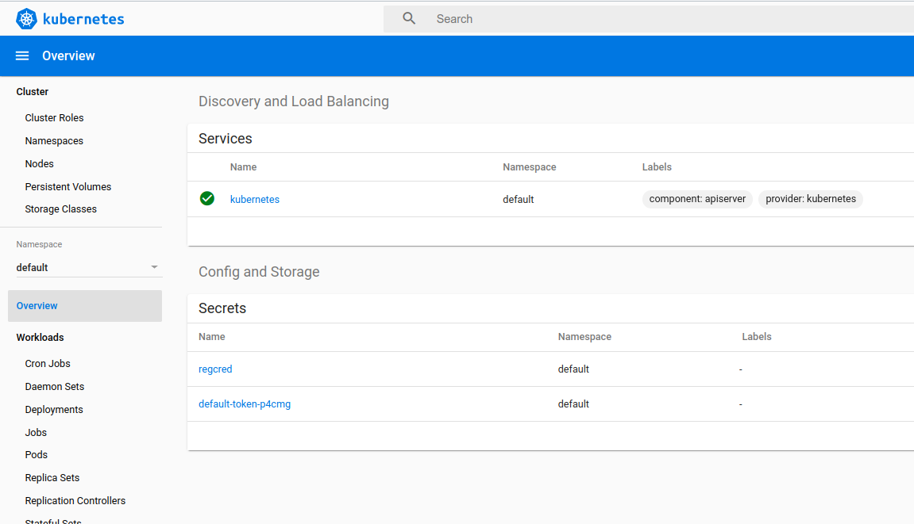

At the moment there's nothing interesting there, after all we haven't deployed anything to the cluster yet, but we'll come back to this page later, so keep the terminal with `kubectl proxy` running.

## Deploying speedtest-api

Now that we've got an connection to our cluster, it's time to try to deploy speedtest-api. Move into the `/speedtest-api`-folder, and apply `speedtest-api.yaml` with the following command.

```shell
$> speedtest-api> kubectl apply -f Deployment/speedtest-api.yaml
deployment.apps/speedtest-api created
service/speedtest-api-service created
```

And just like that, both the deployment and the service was created. Let's have a look at them in the Kubernetes dashboard.

Navigate to the Deployments section in the left menu, and verify that you have a deployment named speedtest-api.

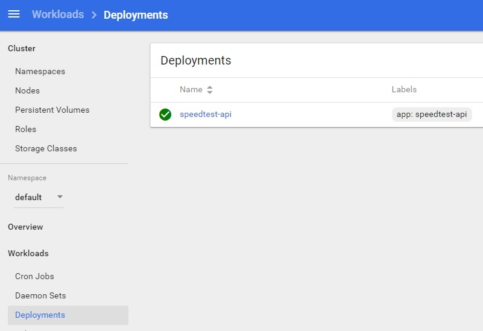

The deployment should have created a running pod.

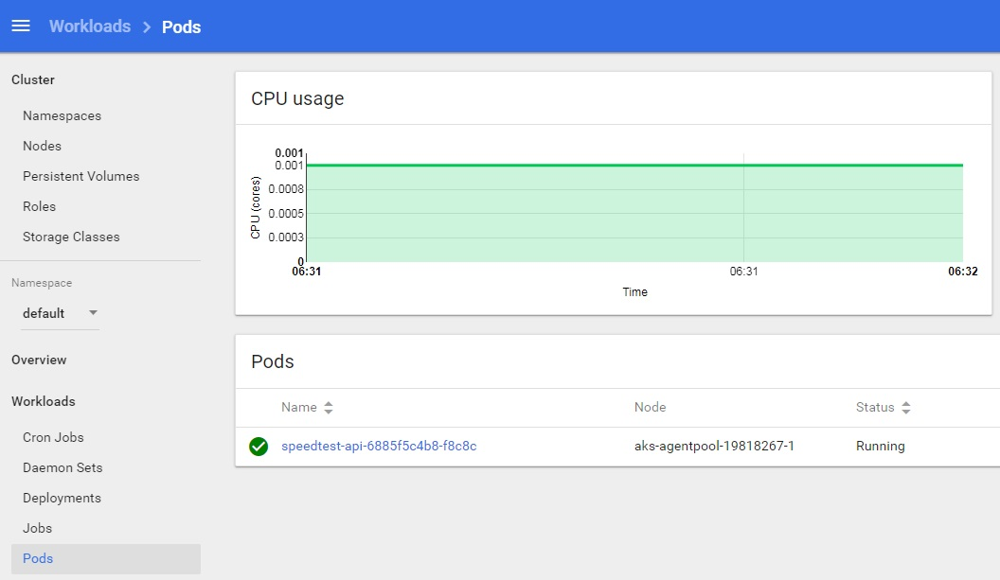

You should also have a running service under _Services_ in the left menu.

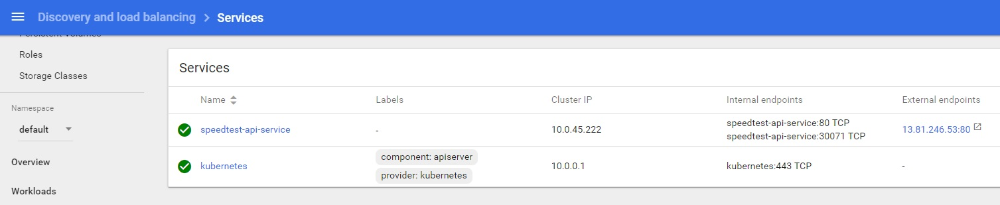

Note that speedtest-api-service has been assigned an external endpoint. Open it and navigate to `/swagger`. You should now see swagger UI for the instance of speedtest-api running on the cluster.

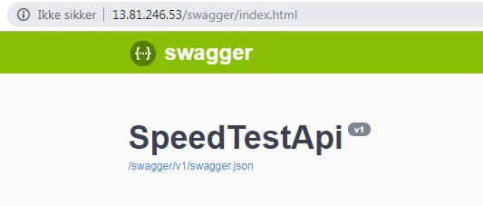

## Deploying speedtest-web

Let's deploy speedtest-web as well. The kubernetes configuration is very similar to speedtest-api, and is located in `/speedtest-web/Deployment/speedtest-web.yaml`.

This time we only have to look at the _Service_:

```yaml
apiVersion: apps/v1
kind: Deployment
metadata:
  name: speedtest-web
spec:
  replicas: 1
  selector:
    matchLabels:
      app: speedtest-web
  template:
    metadata:
      labels:
        app: speedtest-web
    spec:
      imagePullSecrets:
        - name: regcred
      containers:
        - name: speedtest-web
          image: taeregistry.azurecr.io/speed-test-web:0.0.1
          imagePullPolicy: Always
          ports:
            - containerPort: 80
          env:
            - name: SpeedTestApiBase
              value: http://13.81.246.53
```

Again we'll need to update the image with the correct container registry. We also need to configure the webpage to use the address of speedtest-api on the cluster as SpeedTestApiBase, i.e. you'll need to change `http://13.81.246.53` to the external address of your speedtest-api-service.

Save the updated `speedtest-web.yaml` and apply it to kubernetes:

```shell
$ speedtest-web> kubectl apply -f Deployment/speedtest-web.yaml
deployment.apps/speedtest-web created
service/speedtest-web-service created
```

Go to the Kubernetes dashboard, and again verify that a deployment, pod and service was created for speedtest-web. Open the external endpoint of the speedtest-web-service, and navigate to `/index.html`.

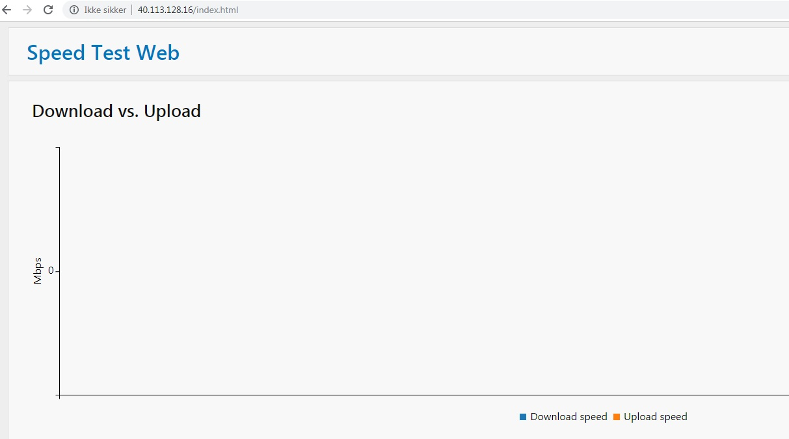

Just as with speedtest-api, we're now viewing the version of speedtest-web deployed to kubernetes. The graphs look a bit empty this time, so let's finally deploy speedtest-logger so we can get some speed tests from the cluster!

## Running speedtest-logger as a job

Both speedtest-api and speedtest-web has been deployed as a _Deployment_ and _Service_, but this time we'll deploy speedtest-logger as a _Job_.

_Jobs_ are an Kubernetes object that is applied, and then runs once. They're useful for batch-processing jobs, database migrations, and most programs that you run once as a console application. Although this will soon change, we'll start out by deploying speedtest-logger as a _Job_.

```yaml
apiVersion: batch/v1
kind: Job
metadata:
  name: speedtest-logger
spec:
  template:
    metadata:
      labels:
        app: speedtest-logger
    spec:
      imagePullSecrets:
        - name: regcred
      containers:
        - name: speedtest-logger
          image: taeregistry.azurecr.io/speed-test-logger:0.0.1
          env:
            - name: singleRun
              value: 'true'
            - name: speedTestApiUrl
              value: http://speedtest-api-service
            - name: KubeMQ_ServerAddress
              value: kubemq-cluster-node:50000
            - name: KubeMQ_Channel
              value: speedtest
      restartPolicy: OnFailure
```

This time, in addition to updating the container registry, we'll ensure that `singleRun` is configured to `true`, and that the value for `speedTestApiUrl` is the same as the `Name` of the `Service` in `speedtest-web.yaml`. For now we can ignore the KubeMQ-related values, they'll be used in the next section. Then we're ready to apply the job.

```shell
$ speedtest-logger> kubectl apply -f .\Deployment\speedtest-logger.yaml
job.batch/speedtest-logger created
```

Let's see if speedtest-logger ran as expected. Open _Jobs_ from the left menu.

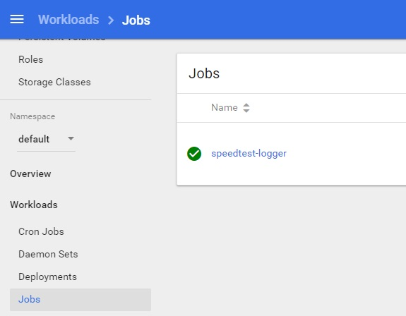

We can also view the logs from speedtest-logger by clicking on the horizontal bars to the far left of the job.

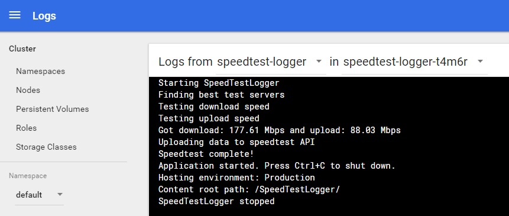

By now you should have a single speed test visible in speedtest-web, and swagger UI for speedtest-api.

### What if I want to run Jobs again?

Kubernetes Jobs can only be applied once. If you want to re-run the same job, you first have to delete it from the cluster. This can be done from the Kubernetes dashboard.

Alternatively, you can continue to the next sections, where we'll run speedtest-logger a lot more.

## What now?

We have deployed the basic speedtest system to Kubernetes, but what should we do with speedtest-scheduler? Join us in the [next section](4-third-party-queue) where we'll install a third-party queue, and trigger speedtest-logger based on messages from speedtest-scheduler.
