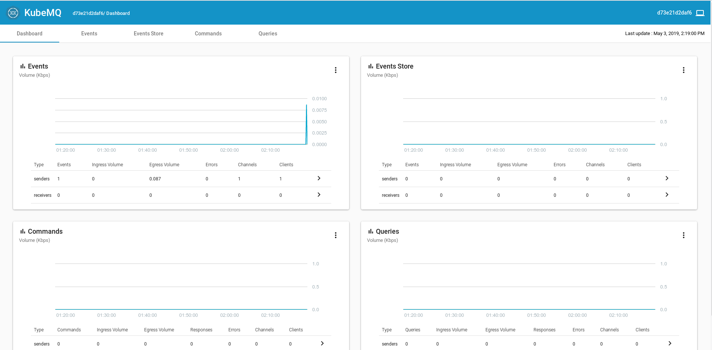
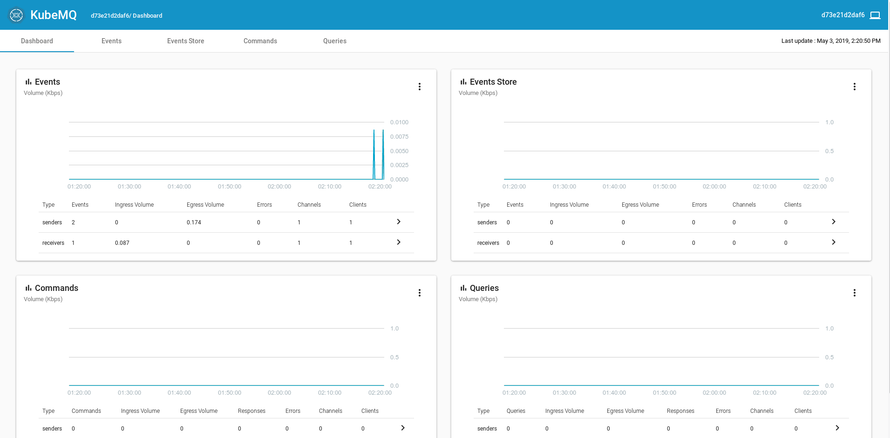

# [Index](index) > The third party queue

_In this section, we'll deploy a queue-solution made by a third party, to our cluster. Then we'll use this queue to trigger speedtest-logger from speedtest-scheduler._

## What queue? KubeMQ!

At this point we could use whatever queue we want, but we have chosen to go for [KubeMQ](https://kubemq.io/). KubeMQ is a easy to use real-time scalable message queue, designed to support high volume messaging with low latency and efficient memory usage. It supports multiple messaging patterns, including real-time pub/sub, witch is what we are going to be using.

### Deploy KubeMQ and KubeMQ-dashboard

There are many nice things about third-party applications, one of then is that many have deployed the same solution before. And in combination with docker, and easy sharing of docker-containers through container-registries, the deployment process is much easier then on a native setup. In this case the creators of KubeMQ have already created a docker image with all the necessary dependencies installed.

There is a couple of ways we could deploy KubeMQ. One way is by using KubeMQ's ready made helm-chart, witch have all the recommended configuration for kubernetes. But since we are going to be looking at [Helm](https://helm.sh/) in a later section, we are going to do this the "native way".

Don't despair, we have already made the configuration files for you. Do deploy KubeMQ, follow the steps below:

1. Clone the codebase from GitHub with `git clone https://github.com/k8s-101/speedtest-scheduler.git`.
2. Navigate into the `/speedtest-scheduler/Deployment`-folder and look at the file `kubeMQ.yaml`.

This file configures both the KubeMQ-queue and a KubeMQ-dashboard. First lets take a look at the KubeMQ-queue, which is deploy as a [StatefulSet](https://kubernetes.io/docs/concepts/workloads/controllers/statefulset/). StatefulSet is a component used to manage multiple replicas of a stateful application. In this case the stateful application is our KubeMQ that we pull down from KubeMq's container registery.

```yaml
#
apiVersion: apps/v1beta2
    kind: StatefulSet
    metadata:
      name: kubemq-cluster
    spec:
      selector:
        # This is how the statefulSet finds it's replicas. You will ses that this label matches the metadata.label under.
        matchLabels:
          app: kubemq-cluster
      replicas: 1  # How many replicas should be created
      serviceName: kubemq-cluster
      template:
        # Labels to categorize the pod
        metadata:
          labels:
            app: kubemq-cluster

        # The recipe on how kubernetes should create a container
        spec:
          containers:
          # A list of environment variables.
            - env:
                - name: KUBEMQ_LOG_LEVEL
                  value: '1'
                - name: METRIC_STORAGE_INTERVAL
                  value: '60'
                - name: KUBEMQ_TOKEN
                  value: 60321dd4-779b-409e-a4dc-ff1525a0e4ff
                - name: CLUSTER_ROUTES
                  value: 'kubemq-cluster:5228'
                - name: CLUSTER_PORT
                  value: '5228'
                - name: CLUSTER_ENABLE
                  value: 'false'
                - name: KUBEMQ_LOG_LEVEL
                  value: '2'
                - name: GRPC_PORT
                  value: '50000'
                - name: REST_PORT
                  value: '9090'
                - name: KUBEMQ_PORT
                  value: '8080'
              image: 'kubemq/kubemq:latest' # The latest KubeMq image from kubeMQ.
              imagePullPolicy: IfNotPresent
              name: kubemq-cluster
               # A list of ports that can be used from outside the Pod/image.
              ports:
                - containerPort: 50000
                  name: grpc-port
                  protocol: TCP
                - containerPort: 8080
                  name: metrics-port
                  protocol: TCP
                - containerPort: 9090
                  name: rest-port
                  protocol: TCP
                - containerPort: 5228
                  name: cluster-port
                  protocol: TCP
          restartPolicy: Always  # If the pod is terminated/crashes, it should always be restarted
```

For anyone to be able to reach our queue we need to create a [Service](https://kubernetes.io/docs/concepts/services-networking/service/). There are many kinds of services, all with different properties. This service is a LoadBalancer, which uses azures loadbalancer to create an external ip.

```yaml
# The Service to KubeMQ

apiVersion: v1
    kind: Service
    metadata:
      name: kubemq-cluster
    spec:
      ports:
        - name: metrics-port
          port: 8080
          protocol: TCP
          targetPort: 8080
        - name: grpc-port
          port: 50000
          protocol: TCP
          targetPort: 50000
        - name: cluster-port
          port: 5228
          protocol: TCP
          targetPort: 5228
        - name: rest-port
          port: 9090
          protocol: TCP
          targetPort: 9090
      sessionAffinity: None
      type: LoadBalancer #  Type of service. The LoadBalancer makes this service reachable from outside the cluster.

      # The selector is used to select all the pods that this service should be pointing at.
      selector:
        app: kubemq-cluster
```

This is all the necessary configuration to get the queue up and running. Now we need to configure the dashboard. The dashboard is a stateless webpage, so we don't need to use a StatefulSet to handle multiple pods. Instead we use a [Deployment](https://kubernetes.io/docs/concepts/workloads/controllers/deployment/), which is a kind of recipe on how kubernetes should create a [ReplicaSet](https://kubernetes.io/docs/concepts/workloads/controllers/replicaset/) and [Pods](https://kubernetes.io/docs/concepts/workloads/pods/pod/). It also defines a desired state in which we want the components to run and how many of them.

In our case the Deployment defines how the pod should be created, like what environment variables to use and where to pull images from. It also defines how many replicas we want.

```yaml
apiVersion: v1
kind: List
items:
  - apiVersion: apps/v1
    kind: Deployment
    metadata:
      name: kubemq-dashboard-deployment
      labels:
        app: kubemq-dashboard

    # The description of our desired state.
    spec:
      replicas: 1 # We want 1 replica
      selector:
        matchLabels:
          app: kubemq-dashboard
      template: # We want the container to be created in this fashion.
        metadata:
          labels:
            app: kubemq-dashboard
        spec:
          containers:
            - name: kubemq-dashboard # Give the container this name
              image: 'kubemq/kubemq-dashboard:latest' # Pull this image
              env: # Set this environment variables
                - name: SOCKET_API
                  value: 'ws://51.144.52.132:8080/v1/stats/'
                - name: DASHBOARD_API
                  value: '//51.144.52.132:8080/v1/stats/'
              ports: # Open this port into the container
                - containerPort: 80
```

And since we want to be able to access the dashboard from outside the cluster, we need to create a Service.

```yaml
- kind: Service
  apiVersion: v1
  metadata:
    name: kubemq-dashboard
  spec:
    type: LoadBalancer
    selector:
      app: kubemq-dashboard
    ports:
      - protocol: TCP
        port: 80
```

3. Deploy KubeMQ with the following command: `kubectl apply -f ./kubeMQ.yaml`;

```bash
$ kubectl apply -f ./kubeMQ.yaml
statefulset.apps/kubemq-cluster configured
service/kubemq-cluster created
deployment.apps/kubemq-dashboard-deployment created
service/kubemq-dashboard created
```

Since we don't have any ingress-controller/proxy (eg. nginx-ingress) (this is a subject in a later section), we have to update the kubeMQ.yaml with some ip addresses.

4. First get the **external ip** for kubemq-cluster service by going to the dashboard or by running the following: `kubectl apply -f ./kubeMQ.yaml`

```bash
$ kubectl apply -f ./kubeMQ.yaml
NAME             TYPE           CLUSTER-IP    EXTERNAL-IP     PORT(S)                                                        AGE
kubemq-cluster   LoadBalancer   10.0.88.109   51.144.52.132   8080:32419/TCP,50000:30985/TCP,5228:32465/TCP,9090:30551/TCP   20m
```

In this case the external ip is **_51.144.52.132_**.

**_It may take a few minutes for azure to get the external ip._**

5. Update kubeMQ.yaml with the external ip:

```yaml
#kubeMQ.yaml

#...
containers:
  - name: kubemq-dashboard
    image: 'kubemq/kubemq-dashboard:latest'
    env:
      - name: SOCKET_API
        value: 'ws://<external ip>:8080/v1/stats/'
        name: DASHBOARD_API
        value: '//<external ip>:8080/v1/stats/'
#...
```

6. Update the KubeMQ by running: `kubectl apply -f ./kubeMQ.yaml` again.

```bash
$ kubectl apply -f ./kubeMQ.yaml
statefulset.apps/kubemq-cluster configured
service/kubemq-cluster unchanged
deployment.apps/kubemq-dashboard-deployment configured
service/kubemq-dashboard unchanged
```

7. Now we only need to find on which external ip the KubeMQ-dashboard is running at: `kubectl apply -f ./kubeMQ.yaml`

```bash
$ kubectl apply -f ./kubeMQ.yaml
NAME               TYPE           CLUSTER-IP     EXTERNAL-IP    PORT(S)        AGE
kubemq-dashboard   LoadBalancer   10.0.168.217   13.69.25.137   80:30356/TCP   3m

```

8. Open the browser at http://externalip, in this case http://13.69.25.137.


Now it's time to make speedtest-scheduler post some events to the queue!

## Publishing events to the queue from speedtest-scheduler.

Now that vi have a queue running, its time to create some events with speedtest-scheduler.

1. Navigate into the `/speedtest-scheduler/Deployment`-folder.
2. Open speedtest-scheduler.yaml for edit and update the following fields.

```yaml
#speedtest-scheduler.yaml

#...
schedule: "0 * * * *" # scheduled to run every hour.
  jobTemplate:
    spec:
      template:
        metadata:
          labels:
            app: speedtest-scheduler
        spec:
          imagePullSecrets:
            - name: regcred # Update this with your secret name
          containers:
            - name: speedtest-scheduler
              image: k8s101registry.azurecr.io/speedtest-scheduler:latest # Updated this with your image tag.
              env:
                - name: KubeMQ_Channel
                  value: speedtest
#...
```

3. Deploy speedtest-scheduler with: `kubectl apply -f speedtest-scheduler.yaml`.

```bash
> kubectl apply -f speedtest-scheduler.yaml
cronjob.batch/speedtest-scheduler-cronjob configured
```

4. This job is configured to run every hour, but you can trigger a run manually from the kubernetes-dashboard or with: `kubectl create job --from=cronjob/speedtest-scheduler speedtest-scheduler-manual-001`

```bash
$ kubectl create job --from=cronjob/speedtest-scheduler speedtest-scheduler-manual-001
job.batch/speedtest-scheduler-manual-001 created
```

5. To see if the job has successful, run: `kubectl get jobs`.
6. To check if the event was sent to the queue, go to the KubeMQ-dashboard from the previous section.



## Configuring speedtest-logger to read events from the queue

Now it's time to make speedtest-logger read from the queue.

1. Navigate into the `/speedtest-logger/Deployment`-folder.
2. Update the `speedtest-logger.yaml` by setting the environment variable singleRun to false

```yaml
# speedtest-logger

apiVersion: batch/v1
kind: Job
metadata:
  name: speedtest-logger
spec:
  template:
    metadata:
      labels:
        app: speedtest-logger
    spec:
      imagePullSecrets:
        - name: regcred
      containers:
        - name: speedtest-logger
          image: k8s101registry.azurecr.io/speedtest-logger:latest
          env:
            - name: singleRun
              value: 'false' # <-- Change here!
            - name: speedTestApiUrl
              value: http://speedtest-api-service # "speedtest-api-service" should be the name of the service pointing to our speedtest-api.
            - name: KubeMQ_ServerAddress
              value: kubemq-cluster:50000 # "kubemq-cluster" should be the name of the service pointeing to our KubeMq-queue.
            - name: KubeMQ_Channel
              value: speedtest
      restartPolicy: OnFailure
```

3. Update the job on kubernetes with: `kubectl apply -f speedtest-logger.yaml`

```bash
$ kubectl apply -f speedtest-logger.yaml
job.batch/speedtest-logger created
```

4. The queue does not store the events, so we need to send a new one:

```bash
$ kubectl create job --from=cronjob/speedtest-scheduler speedtest-scheduler-manual-002
job.batch/speedtest-scheduler-manual-002 created
```

5. To check if the event was sent to the queue, and that the logger has received it, go to the KubeMQ-dashboard from the previous section.



## What now?

Congratulations! You just completed the basic part of this workshop. Going forward we'll visit more advanced topics, starting with [Helm, the package manager for Kubernetes](5-helm-the-package-manager-for-kubernetes).
