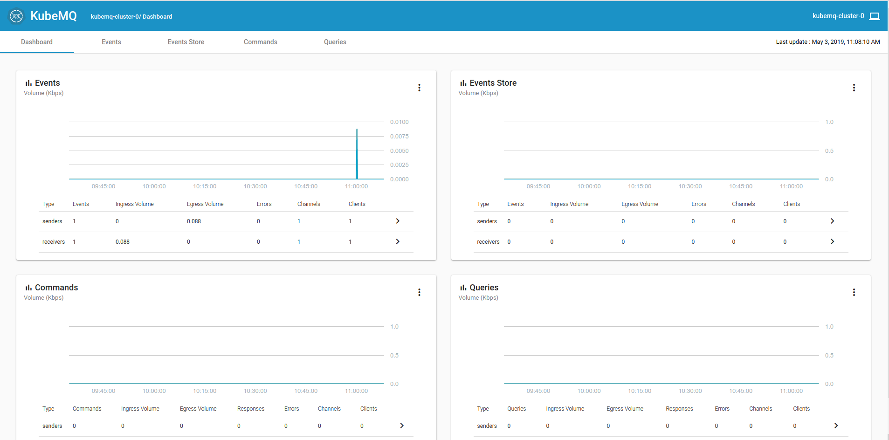

# [Index](index) > The third party queue

_In this section, we'll deploy a queue-solution made by a third party, to our cluster. Then we'll use this queue to trigger speedtest-logger from speedtest-scheduler._

## What queue? KubeMQ!

At this point we could use whatever queue we want, but we have chosen to go for [KubeMQ](https://kubemq.io/). KubeMQ is a easy to use real-time scalable message queue, designed to support high volume messaging with low latency and efficient memory usage. It supports multiple messaging patterns, including real-time pub/sub, witch is what we are going to be using.

### Deploy KubeMQ and KubeMQ-dashboard

There are many nice things about third-party applications, one of then is that many have deployed the same solution before. And in combination with docker, and easy sharing of docker-containers through container-registries, the deployment process is much easier then on a native setup. In this case the creators of KubeMQ have already created a docker image with all the necessary dependencies installed.

There is a couple of ways we could deploy KubeMQ. One way is by using KubeMQ's ready made helm-chart, witch have all the recommended configuration for kubernetes. But since we are going to be looking at [Helm](https://helm.sh/) in a later section, we are going to do this the "native way".

Don't despair, we have already made the configuration files for you. Do deploy KubeMQ, follow the steps below:

1. Navigate into the `/speedtest-scheduler/Deployment`-folder.
2. Deploy KubeMQ with the following command: `kubectl apply -f ./kubeMQ.yaml`;

```bash
$ kubectl apply -f ./kubeMQ.yaml
statefulset.apps/kubemq-cluster configured
service/kubemq-cluster created
deployment.apps/kubemq-dashboard-deployment created
service/kubemq-dashboard created
```

Since we don't have any ingress-controller/proxy (eg. nginx-ingress) (this is a subject in a later section), we have to update the kubeMQ.yaml with some ip addresses.

3. First get the **external ip** for kubemq-cluster service by going to the dashboard or by running the following: `kubectl apply -f ./kubeMQ.yaml`

```bash
$ kubectl apply -f ./kubeMQ.yaml
NAME             TYPE           CLUSTER-IP    EXTERNAL-IP     PORT(S)                                                        AGE
kubemq-cluster   LoadBalancer   10.0.88.109   51.144.52.132   8080:32419/TCP,50000:30985/TCP,5228:32465/TCP,9090:30551/TCP   20m
```

In this case the external ip is **_51.144.52.132_**.

**_It may take a few minutes for azure to get the external ip._**

4. Update kubeMQ.yaml with the external ip:

```yaml
#kubeMQ.yaml

#...
containers:
  - name: kubemq-dashboard
    image: 'kubemq/kubemq-dashboard:latest'
    env:
      - name: SOCKET_API
        value: 'ws://<external ip>:8080/v1/stats/'
        name: DASHBOARD_API
        value: '//<external ip>:8080/v1/stats/'
#...
```

5. Update the KubeMQ by running: `kubectl apply -f ./kubeMQ.yaml` again.

```bash
$ kubectl apply -f ./kubeMQ.yaml
statefulset.apps/kubemq-cluster configured
service/kubemq-cluster unchanged
deployment.apps/kubemq-dashboard-deployment configured
service/kubemq-dashboard unchanged
```

6. Now we only need to find on which external ip the KubeMQ-dashboard is running at: `kubectl apply -f ./kubeMQ.yaml`

```bash
$ kubectl apply -f ./kubeMQ.yaml
NAME               TYPE           CLUSTER-IP     EXTERNAL-IP    PORT(S)        AGE
kubemq-dashboard   LoadBalancer   10.0.168.217   13.69.25.137   80:30356/TCP   3m

```

7. Open the browser at http://<externalip>, in this case http://13.69.25.137.



Now it's time to make speedtest-scheduler post some events to the queue!

## Publishing events to the queue from speedtest-scheduler.

Now that vi have a queue running, its time to create some events with speedtest-scheduler.

1. Navigate into the `/speedtest-scheduler/Deployment`-folder.
2. Open speedtest-scheduler.yaml for edit and update the following fields.

```yaml
#speedtest-scheduler.yaml

#...
schedule: "0 * * * *" # scheduled to run every hour.
  jobTemplate:
    spec:
      template:
        metadata:
          labels:
            app: speedtest-scheduler
        spec:
          imagePullSecrets:
            - name: regcred # Update this with your secret name
          containers:
            - name: speedtest-scheduler
              image: k8s101registry.azurecr.io/speedtest-scheduler:latest # Updated this with your image tag.
              env:
                - name: KubeMQ_Channel
                  value: speedtest
#...
```

3. Deploy speedtest-scheduler with: `kubectl apply -f speedtest-scheduler.yaml`.

```bash
> kubectl apply -f speedtest-scheduler.yaml
cronjob.batch/speedtest-scheduler-cronjob configured
```

4. This job is configured to run every hour, but you can trigger a run manually from the kubernetes-dashboard or with: `kubectl create job --from=cronjob/speedtest-scheduler speedtest-scheduler-manual-001`

```bash
$ kubectl create job --from=cronjob/speedtest-scheduler speedtest-scheduler-manual-001
job.batch/speedtest-scheduler-manual-001 created
```

5. To see if the job has successful, run: `kubectl get jobs`.
6. To check if the event was sent to the queue, go to the KubeMQ-dashboard from the previous section.

## Configuring speedtest-logger to read events from the queue

TODO: All the stuff.

## What now?

Congratulations! You just completed the basic part of this workshop. Going forward we'll visit more advanced topics, starting with [Helm, the package manager for Kubernetes](5-helm-the-package-manager-for-kubernetes).
