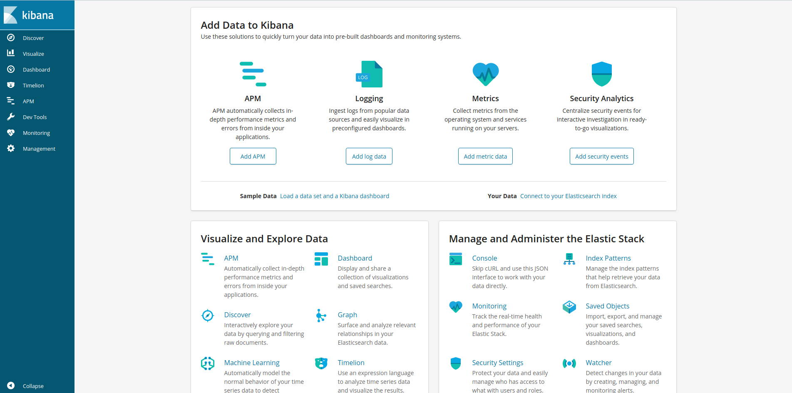
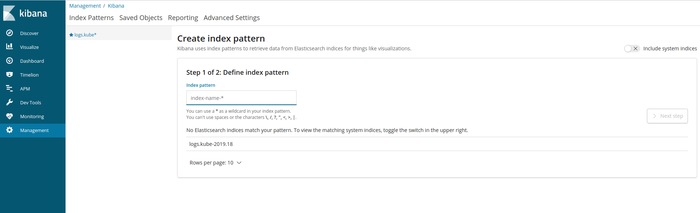
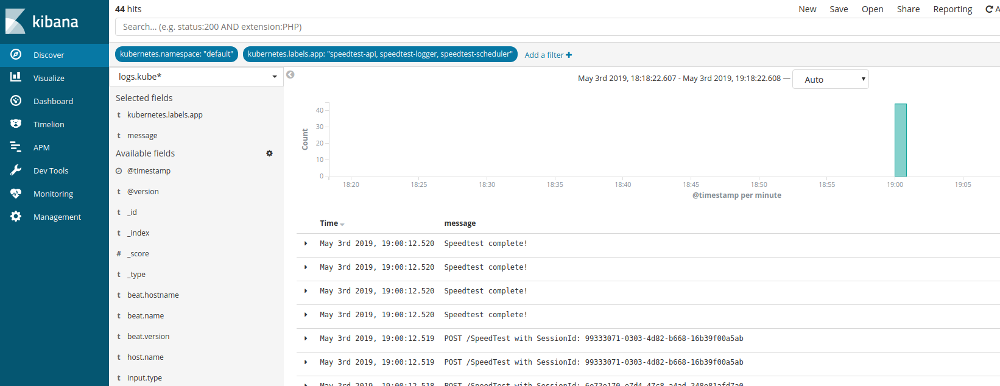

# [Index](index) > ELK <3 Helm

_In this section, we'll install ELK, and configure centralized logging of our speedtest system._

_NB. This section assume that helm is installed_

## Install ELK?

Now let's install [ELK-stack](https://www.elastic.co/elk-stack) by using the readymade helm-chart [elastic-stack](https://github.com/helm/charts/tree/master/stable/elastic-stack). This chart is an umbrealla chart that enable us to use a lot of logging applications, but we are "only" going to be using filebeat, logstash, elasticsearch and kibana.

0. If you dont have instaled nginx-ingress, run the following:

```bash
helm upgrade --install nginx stable/nginx-ingress --set rbac.create=false`
```

1. First we need de create the values.yaml file and configure which applications we want to use.

```yaml
#values.yaml

# This is the filebeat configuration
filebeat:
  enabled: true
  rbac:
    create: false
  config:
    output.file.enabled: false
    output.logstash:
      hosts: ['elk-logstash:5044']
    filebeat.autodiscover:
      providers:
        - type: kubernetes
          hints.enabled: true
    processors:
      - add_cloud_metadata:
      - drop_event:
          when:
            or:
              - equals:
                  kubernetes.namespace: 'kube-system'

  indexTemplateLoad:
    - elk-elasticsearch-client:9200

# This is the elasticsearch configuration
elasticsearch:
  image:
    repository: 'docker.elastic.co/elasticsearch/elasticsearch'
    tag: '6.4.0'
  rbac:
    create: false
  master:
    persistence: # We disable the use of an azure disk.
      enabled: false
  data:
    persistence: # We disable the use of an azure disk.
      enabled: false

# This is the kibana configuration
kibana:
  service:
    externalPort: 80
  image:
    repository: 'docker.elastic.co/kibana/kibana'
    tag: '6.4.0'

  persistentVolumeClaim: # We disable the use of an azure disk.
    enabled: false

  ## Here we create the ingress used by our nginx-ingress
  ingress:
    enabled: true
    hosts:
      - /kibana/?(.*)
    annotations:
      kubernetes.io/ingress.class: nginx
      nginx.ingress.kubernetes.io/rewrite-target: /$1

  env:
    ELASTICSEARCH_URL: http://elk-elasticsearch-client:9200
    SERVER_BASEPATH: /kibana

# This is the kibana configuration
logstash:
  enabled: true
  replicaCount: 1
  persistence:
    enabled: false
  elasticsearch:
    host: elk-elasticsearch-client
  inputs:
    main: |-
      input {
        beats {
          port => 5044
          tags => ["kubernetes-pod-logs", "logs"]
        }
      }

  filters:
    main: |-
      filter {
        if [message] =~ /^\s*$/ {
          drop { }
        }
        if [message] =~ /^{.*}$/{
          json {
            skip_on_invalid_json => true
            source => "message"
          }
        }
      }

  outputs:
    main: |-
      output {
          elasticsearch {
            hosts => ["${ELASTICSEARCH_HOST}:${ELASTICSEARCH_PORT}"]
            manage_template => false
            index => "logs.kube-%{+YYYY.ww}"
          }
        }
```

2. To install the chart run the following:

```bash
helm upgrade --install elk stable/elastic-stack --values values.yaml --namespace logz
```

This will create a release named elk in the namespace logz.

3. Go to kibana: `http://yourhostname.westeurope.cloudapp.azure.com/kibana`



## Configure Kibana?

1. In kibana, hit **Management** in the left meny.
2. Then **Index pattern** --> **Create index pattern**.



3. Create an index pattern like so: `logs*`
4. Hit **Next step**, and select **@timestamp** in the dropdown.
5. Then click **Create index pattern**
6. Hit **Discover** in the left meny, and take a look at your logs.



## What now?
If you have gotten this far, contact Teodor and Simen for more ideas to play with on your cluster.
